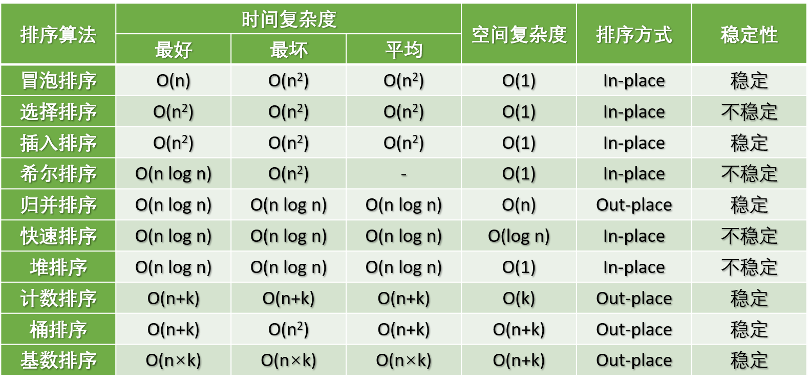
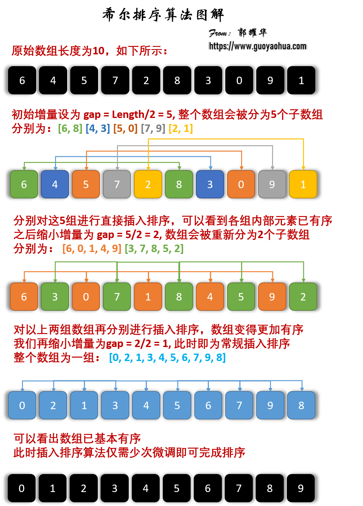
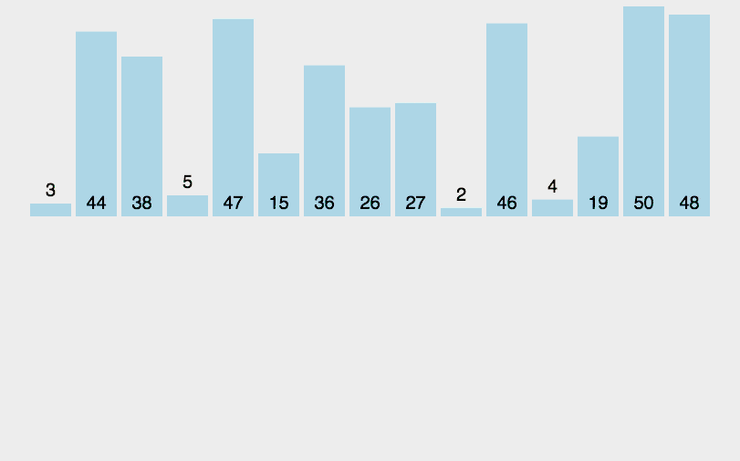
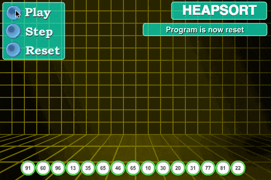
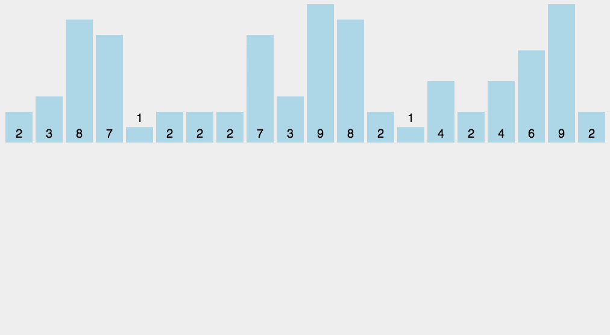
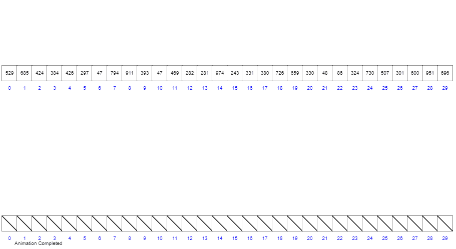
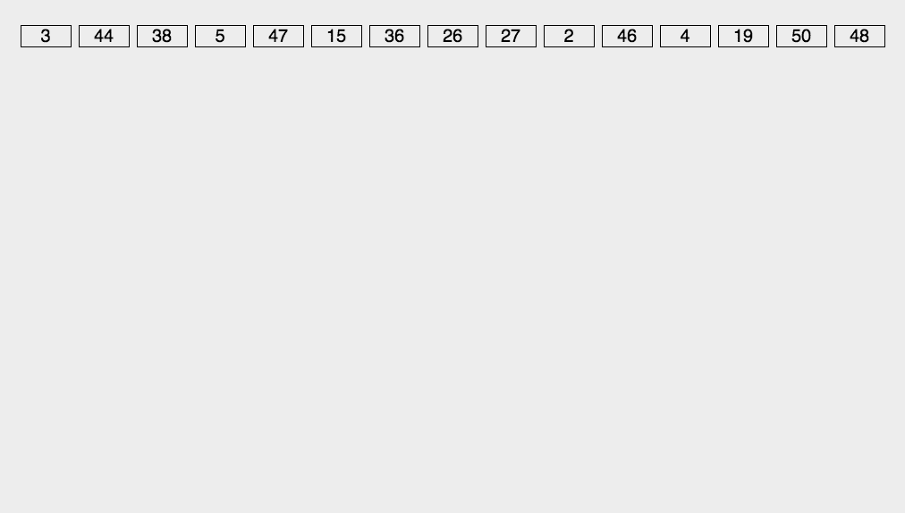

> 本文转自：<http://www.guoyaohua.com/sorting.html>，JavaGuide 对其做了补充完善。

## 引言

所谓排序，就是使一串记录，按照其中的某个或某些关键字的大小，递增或递减的排列起来的操作。排序算法，就是如何使得记录按照要求排列的方法。排序算法在很多领域得到相当地重视，尤其是在大量数据的处理方面。一个优秀的算法可以节省大量的资源。在各个领域中考虑到数据的各种限制和规范，要得到一个符合实际的优秀算法，得经过大量的推理和分析。

两年前，我曾在[博客园](https://www.cnblogs.com/guoyaohua/)发布过一篇[《十大经典排序算法最强总结（含 JAVA 代码实现）》](https://www.cnblogs.com/guoyaohua/p/8600214.html)博文，简要介绍了比较经典的十大排序算法，不过在之前的博文中，仅给出了 Java 版本的代码实现，并且有一些细节上的错误。所以，今天重新写一篇文章，深入了解下十大经典排序算法的原理及实现。

## 简介

排序算法可以分为：

- **内部排序**：数据记录在内存中进行排序。
- **[外部排序](https://zh.wikipedia.org/wiki/外排序)**：因排序的数据很大，一次不能容纳全部的排序记录，在排序过程中需要访问外存。

常见的内部排序算法有：**插入排序**、**希尔排序**、**选择排序**、**冒泡排序**、**归并排序**、**快速排序**、**堆排序**、**基数排序**等，本文只讲解内部排序算法。用一张图概括：



上图存在错误：

1. 插入排序的最好时间复杂度为 O(n) 而不是 O(n^2) 。
2. 希尔排序的平均时间复杂度为 O(nlogn)

**图片名词解释：**

- **n**：数据规模
- **k**：“桶” 的个数
- **In-place**：占用常数内存，不占用额外内存
- **Out-place**：占用额外内存

### 术语说明

- **稳定**：如果 A 原本在 B 前面，而 A=B，排序之后 A 仍然在 B 的前面。
- **不稳定**：如果 A 原本在 B 的前面，而 A=B，排序之后 A 可能会出现在 B 的后面。
- **内排序**：所有排序操作都在内存中完成。
- **外排序**：由于数据太大，因此把数据放在磁盘中，而排序通过磁盘和内存的数据传输才能进行。
- **时间复杂度**：定性描述一个算法执行所耗费的时间。
- **空间复杂度**：定性描述一个算法执行所需内存的大小。

### 算法分类

十种常见排序算法可以分类两大类别：**比较类排序**和**非比较类排序**。


常见的**快速排序**、**归并排序**、**堆排序**以及**冒泡排序**等都属于**比较类排序算法**。比较类排序是通过比较来决定元素间的相对次序，由于其时间复杂度不能突破 `O(nlogn)`，因此也称为非线性时间比较类排序。在冒泡排序之类的排序中，问题规模为 `n`，又因为需要比较 `n` 次，所以平均时间复杂度为 `O(n²)`。在**归并排序**、**快速排序**之类的排序中，问题规模通过**分治法**消减为 `logn` 次，所以时间复杂度平均 `O(nlogn)`。

比较类排序的优势是，适用于各种规模的数据，也不在乎数据的分布，都能进行排序。可以说，比较排序适用于一切需要排序的情况。

而**计数排序**、**基数排序**、**桶排序**则属于**非比较类排序算法**。非比较排序不通过比较来决定元素间的相对次序，而是通过确定每个元素之前，应该有多少个元素来排序。由于它可以突破基于比较排序的时间下界，以线性时间运行，因此称为线性时间非比较类排序。 非比较排序只要确定每个元素之前的已有的元素个数即可，所有一次遍历即可解决。算法时间复杂度 `O(n)`。

非比较排序时间复杂度底，但由于非比较排序需要占用空间来确定唯一位置。所以对数据规模和数据分布有一定的要求。

## 冒泡排序 (Bubble Sort)

冒泡排序是一种简单的排序算法。它重复地遍历要排序的序列，依次比较两个元素，如果它们的顺序错误就把它们交换过来。遍历序列的工作是重复地进行直到没有再需要交换为止，此时说明该序列已经排序完成。这个算法的名字由来是因为越小的元素会经由交换慢慢 “浮” 到数列的顶端。

### 算法步骤

1. 比较相邻的元素。如果第一个比第二个大，就交换它们两个；
2. 对每一对相邻元素作同样的工作，从开始第一对到结尾的最后一对，这样在最后的元素应该会是最大的数；
3. 针对所有的元素重复以上的步骤，除了最后一个；
4. 重复步骤 1~3，直到排序完成。

### 图解算法


### 代码实现

```java
/**
 * 冒泡排序
 * @param arr
 * @return arr
 */
public static int[] bubbleSort(int[] arr) {
    for (int i = 1; i < arr.length; i++) {
        // Set a flag, if true, that means the loop has not been swapped,
        // that is, the sequence has been ordered, the sorting has been completed.
        boolean flag = true;
        for (int j = 0; j < arr.length - i; j++) {
            if (arr[j] > arr[j + 1]) {
                int tmp = arr[j];
                arr[j] = arr[j + 1];
                arr[j + 1] = tmp;
       // Change flag
                flag = false;
            }
        }
        if (flag) {
            break;
        }
    }
    return arr;
}
```

**此处对代码做了一个小优化，加入了 `is_sorted` Flag，目的是将算法的最佳时间复杂度优化为 `O(n)`，即当原输入序列就是排序好的情况下，该算法的时间复杂度就是 `O(n)`。**

### 算法分析

- **稳定性**：稳定
- **时间复杂度**：最佳：O(n) ，最差：O(n2)， 平均：O(n2)
- **空间复杂度**：O(1)
- **排序方式**：In-place

## 选择排序 (Selection Sort)

选择排序是一种简单直观的排序算法，无论什么数据进去都是 `O(n²)` 的时间复杂度。所以用到它的时候，数据规模越小越好。唯一的好处可能就是不占用额外的内存空间了吧。它的工作原理：首先在未排序序列中找到最小（大）元素，存放到排序序列的起始位置，然后，再从剩余未排序元素中继续寻找最小（大）元素，然后放到已排序序列的末尾。以此类推，直到所有元素均排序完毕。

### 算法步骤

1. 首先在未排序序列中找到最小（大）元素，存放到排序序列的起始位置
2. 再从剩余未排序元素中继续寻找最小（大）元素，然后放到已排序序列的末尾。
3. 重复第 2 步，直到所有元素均排序完毕。

### 图解算法


### 代码实现

```java
/**
 * 选择排序
 * @param arr
 * @return arr
 */
public static int[] selectionSort(int[] arr) {
    for (int i = 0; i < arr.length - 1; i++) {
        int minIndex = i;
        for (int j = i + 1; j < arr.length; j++) {
            if (arr[j] < arr[minIndex]) {
                minIndex = j;
            }
        }
        if (minIndex != i) {
            int tmp = arr[i];
            arr[i] = arr[minIndex];
            arr[minIndex] = tmp;
        }
    }
    return arr;
}
```

### 算法分析

- **稳定性**：不稳定
- **时间复杂度**：最佳：O(n2) ，最差：O(n2)， 平均：O(n2)
- **空间复杂度**：O(1)
- **排序方式**：In-place

## 插入排序 (Insertion Sort)

插入排序是一种简单直观的排序算法。它的工作原理是通过构建有序序列，对于未排序数据，在已排序序列中从后向前扫描，找到相应位置并插入。插入排序在实现上，通常采用 in-place 排序（即只需用到 `O(1)` 的额外空间的排序），因而在从后向前扫描过程中，需要反复把已排序元素逐步向后挪位，为最新元素提供插入空间。

插入排序的代码实现虽然没有冒泡排序和选择排序那么简单粗暴，但它的原理应该是最容易理解的了，因为只要打过扑克牌的人都应该能够秒懂。插入排序是一种最简单直观的排序算法，它的工作原理是通过构建有序序列，对于未排序数据，在已排序序列中从后向前扫描，找到相应位置并插入。

插入排序和冒泡排序一样，也有一种优化算法，叫做拆半插入。

### 算法步骤

1. 从第一个元素开始，该元素可以认为已经被排序；
2. 取出下一个元素，在已经排序的元素序列中从后向前扫描；
3. 如果该元素（已排序）大于新元素，将该元素移到下一位置；
4. 重复步骤 3，直到找到已排序的元素小于或者等于新元素的位置；
5. 将新元素插入到该位置后；
6. 重复步骤 2~5。

### 图解算法


### 代码实现

```java
/**
 * 插入排序
 * @param arr
 * @return arr
 */
public static int[] insertionSort(int[] arr) {
    for (int i = 1; i < arr.length; i++) {
        int preIndex = i - 1;
        int current = arr[i];
        while (preIndex >= 0 && current < arr[preIndex]) {
            arr[preIndex + 1] = arr[preIndex];
            preIndex -= 1;
        }
        arr[preIndex + 1] = current;
    }
    return arr;
}
```

### 算法分析

- **稳定性**：稳定
- **时间复杂度**：最佳：O(n) ，最差：O(n2)， 平均：O(n2)
- **空间复杂度**：O(1)
- **排序方式**：In-place

## 希尔排序 (Shell Sort)

希尔排序是希尔 (Donald Shell) 于 1959 年提出的一种排序算法。希尔排序也是一种插入排序，它是简单插入排序经过改进之后的一个更高效的版本，也称为递减增量排序算法，同时该算法是冲破 `O(n²)` 的第一批算法之一。

希尔排序的基本思想是：先将整个待排序的记录序列分割成为若干子序列分别进行直接插入排序，待整个序列中的记录 “基本有序” 时，再对全体记录进行依次直接插入排序。

### 算法步骤

我们来看下希尔排序的基本步骤，在此我们选择增量 `gap=length/2`，缩小增量继续以 `gap = gap/2` 的方式，这种增量选择我们可以用一个序列来表示，`{n/2, (n/2)/2, ..., 1}`，称为**增量序列**。希尔排序的增量序列的选择与证明是个数学难题，我们选择的这个增量序列是比较常用的，也是希尔建议的增量，称为希尔增量，但其实这个增量序列不是最优的。此处我们做示例使用希尔增量。

先将整个待排序的记录序列分割成为若干子序列分别进行直接插入排序，具体算法描述：

- 选择一个增量序列 `{t1, t2, …, tk}`，其中 `(ti>tj, i<j, tk=1)`；
- 按增量序列个数 k，对序列进行 k 趟排序；
- 每趟排序，根据对应的增量 `t`，将待排序列分割成若干长度为 `m` 的子序列，分别对各子表进行直接插入排序。仅增量因子为 1 时，整个序列作为一个表来处理，表长度即为整个序列的长度。

### 图解算法



### 代码实现

```java
/**
 * 希尔排序
 *
 * @param arr
 * @return arr
 */
public static int[] shellSort(int[] arr) {
    int n = arr.length;
    int gap = n / 2;
    while (gap > 0) {
        for (int i = gap; i < n; i++) {
            int current = arr[i];
            int preIndex = i - gap;
            // Insertion sort
            while (preIndex >= 0 && arr[preIndex] > current) {
                arr[preIndex + gap] = arr[preIndex];
                preIndex -= gap;
            }
            arr[preIndex + gap] = current;

        }
        gap /= 2;
    }
    return arr;
}
```

### 算法分析

- **稳定性**：不稳定
- **时间复杂度**：最佳：O(nlogn)， 最差：O(n^2)  平均：O(nlogn)
- **空间复杂度**：`O(1)`

## 归并排序 (Merge Sort)

归并排序是建立在归并操作上的一种有效的排序算法。该算法是采用分治法 (Divide and Conquer) 的一个非常典型的应用。归并排序是一种稳定的排序方法。将已有序的子序列合并，得到完全有序的序列；即先使每个子序列有序，再使子序列段间有序。若将两个有序表合并成一个有序表，称为 2 - 路归并。

和选择排序一样，归并排序的性能不受输入数据的影响，但表现比选择排序好的多，因为始终都是 `O(nlogn)` 的时间复杂度。代价是需要额外的内存空间。

### 算法步骤

归并排序算法是一个递归过程，边界条件为当输入序列仅有一个元素时，直接返回，具体过程如下：

1. 如果输入内只有一个元素，则直接返回，否则将长度为 `n` 的输入序列分成两个长度为 `n/2` 的子序列；
2. 分别对这两个子序列进行归并排序，使子序列变为有序状态；
3. 设定两个指针，分别指向两个已经排序子序列的起始位置；
4. 比较两个指针所指向的元素，选择相对小的元素放入到合并空间（用于存放排序结果），并移动指针到下一位置；
5. 重复步骤 3 ~4 直到某一指针达到序列尾；
6. 将另一序列剩下的所有元素直接复制到合并序列尾。

### 图解算法



### 代码实现

```java
/**
 * 归并排序
 *
 * @param arr
 * @return arr
 */
public static int[] mergeSort(int[] arr) {
    if (arr.length <= 1) {
        return arr;
    }
    int middle = arr.length / 2;
    int[] arr_1 = Arrays.copyOfRange(arr, 0, middle);
    int[] arr_2 = Arrays.copyOfRange(arr, middle, arr.length);
    return merge(mergeSort(arr_1), mergeSort(arr_2));
}

/**
 * Merge two sorted arrays
 *
 * @param arr_1
 * @param arr_2
 * @return sorted_arr
 */
public static int[] merge(int[] arr_1, int[] arr_2) {
    int[] sorted_arr = new int[arr_1.length + arr_2.length];
    int idx = 0, idx_1 = 0, idx_2 = 0;
    while (idx_1 < arr_1.length && idx_2 < arr_2.length) {
        if (arr_1[idx_1] < arr_2[idx_2]) {
            sorted_arr[idx] = arr_1[idx_1];
            idx_1 += 1;
        } else {
            sorted_arr[idx] = arr_2[idx_2];
            idx_2 += 1;
        }
        idx += 1;
    }
    if (idx_1 < arr_1.length) {
        while (idx_1 < arr_1.length) {
            sorted_arr[idx] = arr_1[idx_1];
            idx_1 += 1;
            idx += 1;
        }
    } else {
        while (idx_2 < arr_2.length) {
            sorted_arr[idx] = arr_2[idx_2];
            idx_2 += 1;
            idx += 1;
        }
    }
    return sorted_arr;
}
```

### 算法分析

- **稳定性**：稳定
- **时间复杂度**：最佳：O(nlogn)， 最差：O(nlogn)， 平均：O(nlogn)
- **空间复杂度**：O(n)

## 快速排序 (Quick Sort)

快速排序用到了分治思想，同样的还有归并排序。乍看起来快速排序和归并排序非常相似，都是将问题变小，先排序子串，最后合并。不同的是快速排序在划分子问题的时候经过多一步处理，将划分的两组数据划分为一大一小，这样在最后合并的时候就不必像归并排序那样再进行比较。但也正因为如此，划分的不定性使得快速排序的时间复杂度并不稳定。

快速排序的基本思想：通过一趟排序将待排序列分隔成独立的两部分，其中一部分记录的元素均比另一部分的元素小，则可分别对这两部分子序列继续进行排序，以达到整个序列有序。

### 算法步骤

快速排序使用[分治法](https://zh.wikipedia.org/wiki/分治法)（Divide and conquer）策略来把一个序列分为较小和较大的 2 个子序列，然后递回地排序两个子序列。具体算法描述如下：

1. 从序列中**随机**挑出一个元素，做为 “基准”(`pivot`)；
2. 重新排列序列，将所有比基准值小的元素摆放在基准前面，所有比基准值大的摆在基准的后面（相同的数可以到任一边）。在这个操作结束之后，该基准就处于数列的中间位置。这个称为分区（partition）操作；
3. 递归地把小于基准值元素的子序列和大于基准值元素的子序列进行快速排序。

### 图解算法


### 代码实现

> 来源：[使用 Java 实现快速排序（详解）](https://segmentfault.com/a/1190000040022056)

```java
public static int partition(int[] array, int low, int high) {
    int pivot = array[high];
    int pointer = low;
    for (int i = low; i < high; i++) {
        if (array[i] <= pivot) {
            int temp = array[i];
            array[i] = array[pointer];
            array[pointer] = temp;
            pointer++;
        }
        System.out.println(Arrays.toString(array));
    }
    int temp = array[pointer];
    array[pointer] = array[high];
    array[high] = temp;
    return pointer;
}
public static void quickSort(int[] array, int low, int high) {
    if (low < high) {
        int position = partition(array, low, high);
        quickSort(array, low, position - 1);
        quickSort(array, position + 1, high);
    }
}
```

### 算法分析

- **稳定性**：不稳定
- **时间复杂度**：最佳：O(nlogn)， 最差：O(nlogn)，平均：O(nlogn)
- **空间复杂度**：O(logn)

## 堆排序 (Heap Sort)

堆排序是指利用堆这种数据结构所设计的一种排序算法。堆是一个近似完全二叉树的结构，并同时满足**堆的性质**：即**子结点的值总是小于（或者大于）它的父节点**。

### 算法步骤

1. 将初始待排序列 `(R1, R2, ……, Rn)` 构建成大顶堆，此堆为初始的无序区；
2. 将堆顶元素 `R[1]` 与最后一个元素 `R[n]` 交换，此时得到新的无序区 `(R1, R2, ……, Rn-1)` 和新的有序区 (Rn), 且满足 `R[1, 2, ……, n-1]<=R[n]`；
3. 由于交换后新的堆顶 `R[1]` 可能违反堆的性质，因此需要对当前无序区 `(R1, R2, ……, Rn-1)` 调整为新堆，然后再次将 R [1] 与无序区最后一个元素交换，得到新的无序区 `(R1, R2, ……, Rn-2)` 和新的有序区 `(Rn-1, Rn)`。不断重复此过程直到有序区的元素个数为 `n-1`，则整个排序过程完成。

### 图解算法



### 代码实现

```java
// Global variable that records the length of an array;
static int heapLen;

/**
 * Swap the two elements of an array
 * @param arr
 * @param i
 * @param j
 */
private static void swap(int[] arr, int i, int j) {
    int tmp = arr[i];
    arr[i] = arr[j];
    arr[j] = tmp;
}

/**
 * Build Max Heap
 * @param arr
 */
private static void buildMaxHeap(int[] arr) {
    for (int i = arr.length / 2 - 1; i >= 0; i--) {
        heapify(arr, i);
    }
}

/**
 * Adjust it to the maximum heap
 * @param arr
 * @param i
 */
private static void heapify(int[] arr, int i) {
    int left = 2 * i + 1;
    int right = 2 * i + 2;
    int largest = i;
    if (right < heapLen && arr[right] > arr[largest]) {
        largest = right;
    }
    if (left < heapLen && arr[left] > arr[largest]) {
        largest = left;
    }
    if (largest != i) {
        swap(arr, largest, i);
        heapify(arr, largest);
    }
}

/**
 * Heap Sort
 * @param arr
 * @return
 */
public static int[] heapSort(int[] arr) {
    // index at the end of the heap
    heapLen = arr.length;
    // build MaxHeap
    buildMaxHeap(arr);
    for (int i = arr.length - 1; i > 0; i--) {
        // Move the top of the heap to the tail of the heap in turn
        swap(arr, 0, i);
        heapLen -= 1;
        heapify(arr, 0);
    }
    return arr;
}
```

### 算法分析

- **稳定性**：不稳定
- **时间复杂度**：最佳：O(nlogn)， 最差：O(nlogn)， 平均：O(nlogn)
- **空间复杂度**：O(1)

## 计数排序 (Counting Sort)

计数排序的核心在于将输入的数据值转化为键存储在额外开辟的数组空间中。 作为一种线性时间复杂度的排序，**计数排序要求输入的数据必须是有确定范围的整数**。

计数排序 (Counting sort) 是一种稳定的排序算法。计数排序使用一个额外的数组 `C`，其中第 `i` 个元素是待排序数组 `A` 中值等于 `i` 的元素的个数。然后根据数组 `C` 来将 `A` 中的元素排到正确的位置。**它只能对整数进行排序**。

### 算法步骤

1. 找出数组中的最大值 `max`、最小值 `min`；
2. 创建一个新数组 `C`，其长度是 `max-min+1`，其元素默认值都为 0；
3. 遍历原数组 `A` 中的元素 `A[i]`，以 `A[i]-min` 作为 `C` 数组的索引，以 `A[i]` 的值在 `A` 中元素出现次数作为 `C[A[i]-min]` 的值；
4. 对 `C` 数组变形，**新元素的值是该元素与前一个元素值的和**，即当 `i>1` 时 `C[i] = C[i] + C[i-1]`；
5. 创建结果数组 `R`，长度和原始数组一样。
6. **从后向前**遍历原始数组 `A` 中的元素 `A[i]`，使用 `A[i]` 减去最小值 `min` 作为索引，在计数数组 `C` 中找到对应的值 `C[A[i]-min]`，`C[A[i]-min]-1` 就是 `A[i]` 在结果数组 `R` 中的位置，做完上述这些操作，将 `count[A[i]-min]` 减小 1。

### 图解算法



### 代码实现

```java
/**
 * Gets the maximum and minimum values in the array
 *
 * @param arr
 * @return
 */
private static int[] getMinAndMax(int[] arr) {
    int maxValue = arr[0];
    int minValue = arr[0];
    for (int i = 0; i < arr.length; i++) {
        if (arr[i] > maxValue) {
            maxValue = arr[i];
        } else if (arr[i] < minValue) {
            minValue = arr[i];
        }
    }
    return new int[] { minValue, maxValue };
}

/**
 * Counting Sort
 *
 * @param arr
 * @return
 */
public static int[] countingSort(int[] arr) {
    if (arr.length < 2) {
        return arr;
    }
    int[] extremum = getMinAndMax(arr);
    int minValue = extremum[0];
    int maxValue = extremum[1];
    int[] countArr = new int[maxValue - minValue + 1];
    int[] result = new int[arr.length];

    for (int i = 0; i < arr.length; i++) {
        countArr[arr[i] - minValue] += 1;
    }
    for (int i = 1; i < countArr.length; i++) {
        countArr[i] += countArr[i - 1];
    }
    for (int i = arr.length - 1; i >= 0; i--) {
        int idx = countArr[arr[i] - minValue] - 1;
        result[idx] = arr[i];
        countArr[arr[i] - minValue] -= 1;
    }
    return result;
}
```

## 算法分析

当输入的元素是 `n` 个 `0` 到 `k` 之间的整数时，它的运行时间是 `O(n+k)`。计数排序不是比较排序，排序的速度快于任何比较排序算法。由于用来计数的数组 `C` 的长度取决于待排序数组中数据的范围（等于待排序数组的**最大值与最小值的差加上 1**），这使得计数排序对于数据范围很大的数组，需要大量额外内存空间。

- **稳定性**：稳定
- **时间复杂度**：最佳：`O(n+k)` 最差：`O(n+k)` 平均：`O(n+k)`
- **空间复杂度**：`O(k)`

## 桶排序 (Bucket Sort)

桶排序是计数排序的升级版。它利用了函数的映射关系，高效与否的关键就在于这个映射函数的确定。为了使桶排序更加高效，我们需要做到这两点：

1. 在额外空间充足的情况下，尽量增大桶的数量
2. 使用的映射函数能够将输入的 N 个数据均匀的分配到 K 个桶中

桶排序的工作的原理：假设输入数据服从均匀分布，将数据分到有限数量的桶里，每个桶再分别排序（有可能再使用别的排序算法或是以递归方式继续使用桶排序进行。

### 算法步骤

1. 设置一个 BucketSize，作为每个桶所能放置多少个不同数值；
2. 遍历输入数据，并且把数据依次映射到对应的桶里去；
3. 对每个非空的桶进行排序，可以使用其它排序方法，也可以递归使用桶排序；
4. 从非空桶里把排好序的数据拼接起来。

### 图解算法



### 代码实现

```java
/**
 * Gets the maximum and minimum values in the array
 * @param arr
 * @return
 */
private static int[] getMinAndMax(List<Integer> arr) {
    int maxValue = arr.get(0);
    int minValue = arr.get(0);
    for (int i : arr) {
        if (i > maxValue) {
            maxValue = i;
        } else if (i < minValue) {
            minValue = i;
        }
    }
    return new int[] { minValue, maxValue };
}

/**
 * Bucket Sort
 * @param arr
 * @return
 */
public static List<Integer> bucketSort(List<Integer> arr, int bucket_size) {
    if (arr.size() < 2 || bucket_size == 0) {
        return arr;
    }
    int[] extremum = getMinAndMax(arr);
    int minValue = extremum[0];
    int maxValue = extremum[1];
    int bucket_cnt = (maxValue - minValue) / bucket_size + 1;
    List<List<Integer>> buckets = new ArrayList<>();
    for (int i = 0; i < bucket_cnt; i++) {
        buckets.add(new ArrayList<Integer>());
    }
    for (int element : arr) {
        int idx = (element - minValue) / bucket_size;
        buckets.get(idx).add(element);
    }
    for (int i = 0; i < buckets.size(); i++) {
        if (buckets.get(i).size() > 1) {
            buckets.set(i, sort(buckets.get(i), bucket_size / 2));
        }
    }
    ArrayList<Integer> result = new ArrayList<>();
    for (List<Integer> bucket : buckets) {
        for (int element : bucket) {
            result.add(element);
        }
    }
    return result;
}
```

### 算法分析

- **稳定性**：稳定
- **时间复杂度**：最佳：`O(n+k)` 最差：`O(n²)` 平均：`O(n+k)`
- **空间复杂度**：`O(n+k)`

## 基数排序 (Radix Sort)

基数排序也是非比较的排序算法，对元素中的每一位数字进行排序，从最低位开始排序，复杂度为 `O(n×k)`，`n` 为数组长度，`k` 为数组中元素的最大的位数；

基数排序是按照低位先排序，然后收集；再按照高位排序，然后再收集；依次类推，直到最高位。有时候有些属性是有优先级顺序的，先按低优先级排序，再按高优先级排序。最后的次序就是高优先级高的在前，高优先级相同的低优先级高的在前。基数排序基于分别排序，分别收集，所以是稳定的。

### 算法步骤

1. 取得数组中的最大数，并取得位数，即为迭代次数 `N`（例如：数组中最大数值为 1000，则 `N=4`）；
2. `A` 为原始数组，从最低位开始取每个位组成 `radix` 数组；
3. 对 `radix` 进行计数排序（利用计数排序适用于小范围数的特点）；
4. 将 `radix` 依次赋值给原数组；
5. 重复 2~4 步骤 `N` 次

### 图解算法



### 代码实现

```java
/**
 * Radix Sort
 *
 * @param arr
 * @return
 */
public static int[] radixSort(int[] arr) {
    if (arr.length < 2) {
        return arr;
    }
    int N = 1;
    int maxValue = arr[0];
    for (int element : arr) {
        if (element > maxValue) {
            maxValue = element;
        }
    }
    while (maxValue / 10 != 0) {
        maxValue = maxValue / 10;
        N += 1;
    }
    for (int i = 0; i < N; i++) {
        List<List<Integer>> radix = new ArrayList<>();
        for (int k = 0; k < 10; k++) {
            radix.add(new ArrayList<Integer>());
        }
        for (int element : arr) {
            int idx = (element / (int) Math.pow(10, i)) % 10;
            radix.get(idx).add(element);
        }
        int idx = 0;
        for (List<Integer> l : radix) {
            for (int n : l) {
                arr[idx++] = n;
            }
        }
    }
    return arr;
}
```

### 算法分析

- **稳定性**：稳定
- **时间复杂度**：最佳：`O(n×k)` 最差：`O(n×k)` 平均：`O(n×k)`
- **空间复杂度**：`O(n+k)`

**基数排序 vs 计数排序 vs 桶排序**

这三种排序算法都利用了桶的概念，但对桶的使用方法上有明显差异：

- 基数排序：根据键值的每位数字来分配桶
- 计数排序：每个桶只存储单一键值
- 桶排序：每个桶存储一定范围的数值

## 参考文章

- <https://www.cnblogs.com/guoyaohua/p/8600214.html>
- <https://en.wikipedia.org/wiki/Sorting_algorithm>
- <https://sort.hust.cc/>