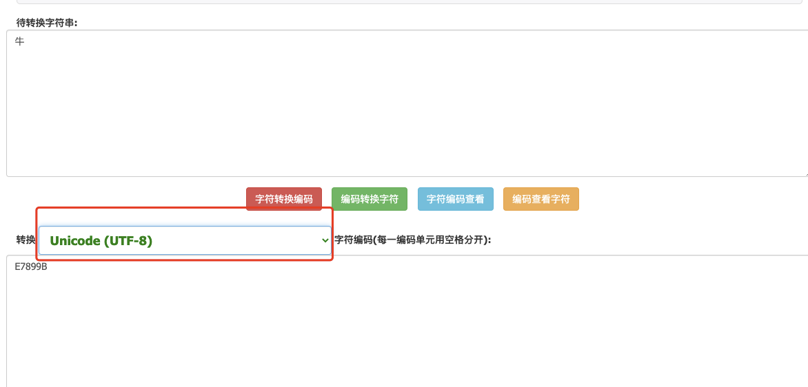
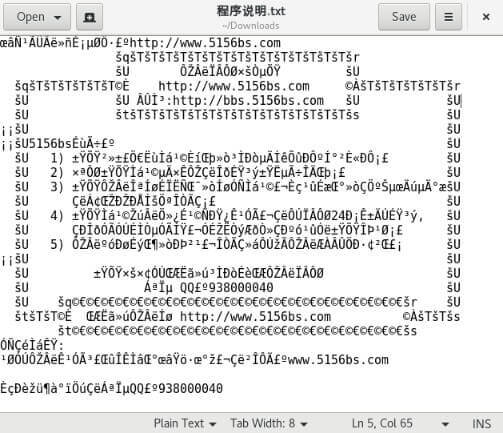
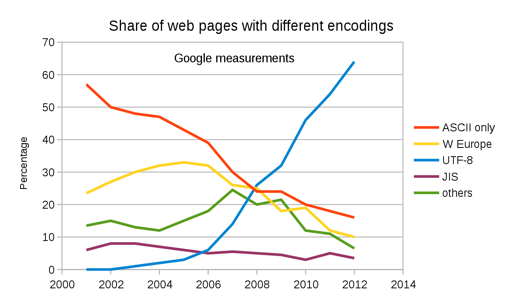
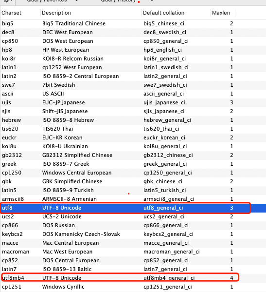

MySQL 字符编码集中有两套 UTF-8 编码实现：**`utf8`** 和 **`utf8mb4`**。

如果使用 **`utf8`** 的话，存储 emoji 符号和一些比较复杂的汉字、繁体字就会出错。

为什么会这样呢？这篇文章可以从源头给你解答。

## 何为字符集？

字符是各种文字和符号的统称，包括各个国家文字、标点符号、表情、数字等等。 **字符集** 就是一系列字符的集合。字符集的种类较多，每个字符集可以表示的字符范围通常不同，就比如说有些字符集是无法表示汉字的。

**计算机只能存储二进制的数据，那英文、汉字、表情等字符应该如何存储呢？**

我们要将这些字符和二进制的数据一一对应起来，比如说字符“a”对应“01100001”，反之，“01100001”对应 “a”。我们将字符对应二进制数据的过程称为"**字符编码**"，反之，二进制数据解析成字符的过程称为“**字符解码**”。

## 有哪些常见的字符集？

常见的字符集有 ASCII、GB2312、GBK、UTF-8......。

不同的字符集的主要区别在于：

- 可以表示的字符范围
- 编码方式

### ASCII

**ASCII** (**A**merican **S**tandard **C**ode for **I**nformation **I**nterchange，美国信息交换标准代码) 是一套主要用于现代美国英语的字符集（这也是 ASCII 字符集的局限性所在）。

**为什么 ASCII 字符集没有考虑到中文等其他字符呢？** 因为计算机是美国人发明的，当时，计算机的发展还处于比较雏形的时代，还未在其他国家大规模使用。因此，美国发布 ASCII 字符集的时候没有考虑兼容其他国家的语言。

ASCII 字符集至今为止共定义了 128 个字符，其中有 33 个控制字符（比如回车、删除）无法显示。

一个 ASCII 码长度是一个字节也就是 8 个 bit，比如“a”对应的 ASCII 码是“01100001”。不过，最高位是 0 仅仅作为校验位，其余 7 位使用 0 和 1 进行组合，所以，ASCII 字符集可以定义 128（2^7）个字符。

由于，ASCII 码可以表示的字符实在是太少了。后来，人们对其进行了扩展得到了 **ASCII 扩展字符集** 。ASCII 扩展字符集使用 8 位（bits）表示一个字符，所以，ASCII 扩展字符集可以定义 256（2^8）个字符。


### GB2312

我们上面说了，ASCII 字符集是一种现代美国英语适用的字符集。因此，很多国家都捣鼓了一个适合自己国家语言的字符集。

GB2312 字符集是一种对汉字比较友好的字符集，共收录 6700 多个汉字，基本涵盖了绝大部分常用汉字。不过，GB2312 字符集不支持绝大部分的生僻字和繁体字。

对于英语字符，GB2312 编码和 ASCII 码是相同的，1 字节编码即可。对于非英字符，需要 2 字节编码。

### GBK

GBK 字符集可以看作是 GB2312 字符集的扩展，兼容 GB2312 字符集，共收录了 20000 多个汉字。

GBK 中 K 是汉语拼音 Kuo Zhan（扩展）中的“Kuo”的首字母。

### GB18030

GB18030 完全兼容 GB2312 和 GBK 字符集，纳入中国国内少数民族的文字，且收录了日韩汉字，是目前为止最全面的汉字字符集，共收录汉字 70000 多个。

### BIG5

BIG5 主要针对的是繁体中文，收录了 13000 多个汉字。

### Unicode & UTF-8 编码

为了更加适合本国语言，诞生了很多种字符集。

我们上面也说了不同的字符集可以表示的字符范围以及编码规则存在差异。这就导致了一个非常严重的问题：**使用错误的编码方式查看一个包含字符的文件就会产生乱码现象。**

就比如说你使用 UTF-8 编码方式打开 GB2312 编码格式的文件就会出现乱码。示例：“牛”这个汉字 GB2312 编码后的十六进制数值为 “C5A3”，而 “C5A3” 用 UTF-8 解码之后得到的却是 “ţ”。

你可以通过这个网站在线进行编码和解码：<https://www.haomeili.net/HanZi/ZiFuBianMaZhuanHuan>



这样我们就搞懂了乱码的本质：**编码和解码时用了不同或者不兼容的字符集** 。



为了解决这个问题，人们就想：“如果我们能够有一种字符集将世界上所有的字符都纳入其中就好了！”。

然后，**Unicode** 带着这个使命诞生了。

Unicode 字符集中包含了世界上几乎所有已知的字符。不过，Unicode 字符集并没有规定如何存储这些字符（也就是如何使用二进制数据表示这些字符）。

然后，就有了 **UTF-8**（**8**-bit **U**nicode **T**ransformation **F**ormat）。类似的还有 UTF-16、 UTF-32。

UTF-8 使用 1 到 4 个字节为每个字符编码， UTF-16 使用 2 或 4 个字节为每个字符编码，UTF-32 固定位 4 个字节为每个字符编码。

UTF-8 可以根据不同的符号自动选择编码的长短，像英文字符只需要 1 个字节就够了，这一点 ASCII 字符集一样 。因此，对于英语字符，UTF-8 编码和 ASCII 码是相同的。

UTF-32 的规则最简单，不过缺陷也比较明显，对于英文字母这类字符消耗的空间是 UTF-8 的 4 倍之多。

**UTF-8** 是目前使用最广的一种字符编码。



## MySQL 字符集

MySQL 支持很多种字符编码的方式，比如 UTF-8、GB2312、GBK、BIG5。

### 查看支持的字符集

你可以通过 `SHOW CHARSET` 命令来查看，支持 like 和 where 子句。



### 默认字符集

在 MySQL5.7 中，默认字符集是 `latin1` ；在 MySQL8.0 中，默认字符集是 `utf8mb4`

### 字符集的层次级别

MySQL 中的字符集有以下的层次级别：

- `server`（MySQL 实例级别）
- `database`（库级别）
- `table`（表级别）
- `column`（字段级别）

它们的优先级可以简单的认为是从上往下依次增大，也即 `column` 的优先级会大于 `table` 等其余层次的。如指定 MySQL 实例级别字符集是`utf8mb4`，指定某个表字符集是`latin1`，那么这个表的所有字段如果不指定的话，编码就是`latin1`。

#### server

不同版本的 MySQL 其 `server` 级别的字符集默认值不同，在 MySQL5.7 中，其默认值是 `latin1` ；在 MySQL8.0 中，其默认值是 `utf8mb4` 。

当然也可以通过在启动 `mysqld` 时指定 `--character-set-server` 来设置 `server` 级别的字符集。

```bash
mysqld
mysqld --character-set-server=utf8mb4
mysqld --character-set-server=utf8mb4 \
  --collation-server=utf8mb4_0900_ai_ci
```

或者如果你是通过源码构建的方式启动的 MySQL，你可以在 `cmake` 命令中指定选项：

```sh
cmake . -DDEFAULT_CHARSET=latin1
或者
cmake . -DDEFAULT_CHARSET=latin1 \
  -DDEFAULT_COLLATION=latin1_german1_ci
```

此外，你也可以在运行时改变 `character_set_server` 的值，从而达到修改 `server` 级别的字符集的目的。

`server` 级别的字符集是 MySQL 服务器的全局设置，它不仅会作为创建或修改数据库时的默认字符集（如果没有指定其他字符集），还会影响到客户端和服务器之间的连接字符集，具体可以查看 [MySQL Connector/J 8.0 - 6.7 Using Character Sets and Unicode](https://dev.mysql.com/doc/connector-j/8.0/en/connector-j-reference-charsets.html)。

#### database

`database` 级别的字符集是我们在创建数据库和修改数据库时指定的：

```sql
CREATE DATABASE db_name
    [[DEFAULT] CHARACTER SET charset_name]
    [[DEFAULT] COLLATE collation_name]

ALTER DATABASE db_name
    [[DEFAULT] CHARACTER SET charset_name]
    [[DEFAULT] COLLATE collation_name]
```

如前面所说，如果在执行上述语句时未指定字符集，那么 MySQL 将会使用 `server` 级别的字符集。

可以通过下面的方式查看某个数据库的字符集：

```sql
USE db_name;
SELECT @@character_set_database, @@collation_database;
```

```sql
SELECT DEFAULT_CHARACTER_SET_NAME, DEFAULT_COLLATION_NAME
FROM INFORMATION_SCHEMA.SCHEMATA WHERE SCHEMA_NAME = 'db_name';
```

#### table

`table` 级别的字符集是在创建表和修改表时指定的：

```sql
CREATE TABLE tbl_name (column_list)
    [[DEFAULT] CHARACTER SET charset_name]
    [COLLATE collation_name]]

ALTER TABLE tbl_name
    [[DEFAULT] CHARACTER SET charset_name]
    [COLLATE collation_name]
```

如果在创建表和修改表时未指定字符集，那么将会使用 `database` 级别的字符集。

#### column

`column` 级别的字符集同样是在创建表和修改表时指定的，只不过它是定义在列中。下面是个例子：

```sql
CREATE TABLE t1
(
    col1 VARCHAR(5)
      CHARACTER SET latin1
      COLLATE latin1_german1_ci
);
```

如果未指定列级别的字符集，那么将会使用表级别的字符集。

### 连接字符集

前面说到了字符集的层次级别，它们是和存储相关的。而连接字符集涉及的是和 MySQL 服务器的通信。

连接字符集与下面这几个变量息息相关：

- `character_set_client` ：描述了客户端发送给服务器的 SQL 语句使用的是什么字符集。
- `character_set_connection` ：描述了服务器接收到 SQL 语句时使用什么字符集进行翻译。
- `character_set_results` ：描述了服务器返回给客户端的结果使用的是什么字符集。

它们的值可以通过下面的 SQL 语句查询：

```sql
SELECT * FROM performance_schema.session_variables
WHERE VARIABLE_NAME IN (
'character_set_client', 'character_set_connection',
'character_set_results', 'collation_connection'
) ORDER BY VARIABLE_NAME;
```

```sql
SHOW SESSION VARIABLES LIKE 'character\_set\_%';
```

如果要想修改前面提到的几个变量的值，有以下方式：

1、修改配置文件

```properties
[mysql]
# 只针对MySQL客户端程序
default-character-set=utf8mb4
```

2、使用 SQL 语句

```sql
set names utf8mb4
# 或者一个个进行修改
# SET character_set_client = utf8mb4;
# SET character_set_results = utf8mb4;
# SET collation_connection = utf8mb4;
```

### jdbc 对连接字符集的影响

不知道你们有没有碰到过存储 emoji 表情正常，但是使用类似 Navicat 之类的软件的进行查询的时候，发现 emoji 表情变成了问号的情况。这个问题很有可能就是 jdbc 驱动引起的。

根据前面的内容，我们知道连接字符集也是会影响我们存储的数据的，而 jdbc 驱动会影响连接字符集。

`mysql-connector-java` （jdbc 驱动）主要通过这几个属性影响连接字符集：

- `characterEncoding`
- `characterSetResults`

以 `DataGrip 2023.1.2` 来说，在它配置数据源的高级对话框中，可以看到 `characterSetResults` 的默认值是 `utf8` ，在使用 `mysql-connector-java 8.0.25` 时，连接字符集最后会被设置成 `utf8mb3` 。那么这种情况下 emoji 表情就会被显示为问号，并且当前版本驱动还不支持把 `characterSetResults` 设置为 `utf8mb4` ，不过换成 `mysql-connector-java driver 8.0.29` 却是允许的。

具体可以看一下 StackOverflow 的 [DataGrip MySQL stores emojis correctly but displays them as?](https://stackoverflow.com/questions/54815419/datagrip-mysql-stores-emojis-correctly-but-displays-them-as)这个回答。

### UTF-8 使用

通常情况下，我们建议使用 UTF-8 作为默认的字符编码方式。

不过，这里有一个小坑。

MySQL 字符编码集中有两套 UTF-8 编码实现：

- **`utf8`**：`utf8`编码只支持`1-3`个字节 。 在 `utf8` 编码中，中文是占 3 个字节，其他数字、英文、符号占一个字节。但 emoji 符号占 4 个字节，一些较复杂的文字、繁体字也是 4 个字节。
- **`utf8mb4`**：UTF-8 的完整实现，正版！最多支持使用 4 个字节表示字符，因此，可以用来存储 emoji 符号。

**为什么有两套 UTF-8 编码实现呢？** 原因如下：


因此，如果你需要存储`emoji`类型的数据或者一些比较复杂的文字、繁体字到 MySQL 数据库的话，数据库的编码一定要指定为`utf8mb4` 而不是`utf8` ，要不然存储的时候就会报错了。

演示一下吧！（环境：MySQL 5.7+）

建表语句如下，我们指定数据库 CHARSET 为 `utf8` 。

```sql
CREATE TABLE `user` (
  `id` varchar(66) CHARACTER SET utf8mb3 NOT NULL,
  `name` varchar(33) CHARACTER SET utf8mb3 NOT NULL,
  `phone` varchar(33) CHARACTER SET utf8mb3 DEFAULT NULL,
  `password` varchar(100) CHARACTER SET utf8mb3 DEFAULT NULL
) ENGINE=InnoDB DEFAULT CHARSET=utf8;
```

当我们执行下面的 insert 语句插入数据到数据库时，果然报错！

```sql
INSERT INTO `user` (`id`, `name`, `phone`, `password`)
VALUES
 ('A00003', 'guide哥😘😘😘', '181631312312', '123456');

```

报错信息如下：

```
Incorrect string value: '\xF0\x9F\x98\x98\xF0\x9F...' for column 'name' at row 1
```

## 参考

- 字符集和字符编码（Charset & Encoding）：<https://www.cnblogs.com/skynet/archive/2011/05/03/2035105.html>
- 十分钟搞清字符集和字符编码：<http://cenalulu.github.io/linux/character-encoding/>
- Unicode-维基百科：<https://zh.wikipedia.org/wiki/Unicode>
- GB2312-维基百科：<https://zh.wikipedia.org/wiki/GB_2312>
- UTF-8-维基百科：<https://zh.wikipedia.org/wiki/UTF-8>
- GB18030-维基百科: <https://zh.wikipedia.org/wiki/GB_18030>
- MySQL8 文档：<https://dev.mysql.com/doc/refman/8.0/en/charset.html>
- MySQL5.7 文档：<https://dev.mysql.com/doc/refman/5.7/en/charset.html>
- MySQL Connector/J 文档：<https://dev.mysql.com/doc/connector-j/8.0/en/connector-j-reference-charsets.html>