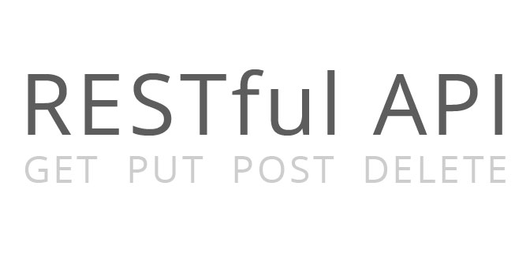
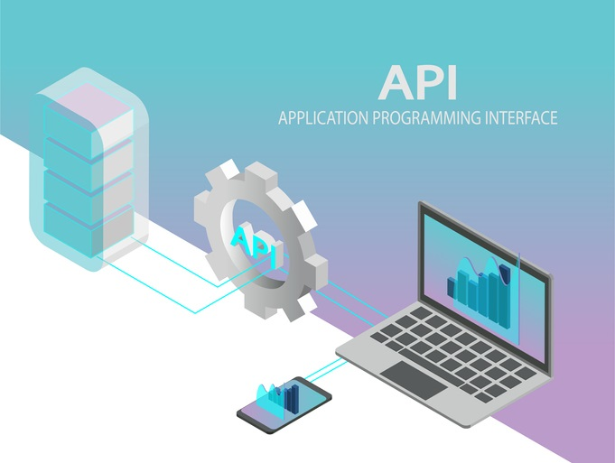

这篇文章简单聊聊后端程序员必备的 RESTful API 相关的知识。

开始正式介绍 RESTful API 之前，我们需要首先搞清：**API 到底是什么？**

## 何为 API？



**API（Application Programming Interface）** 翻译过来是应用程序编程接口的意思。

我们在进行后端开发的时候，主要的工作就是为前端或者其他后端服务提供 API 比如查询用户数据的 API 。


但是， API 不仅仅代表后端系统暴露的接口，像框架中提供的方法也属于 API 的范畴。

为了方便大家理解，我再列举几个例子 🌰：

1. 你通过某电商网站搜索某某商品，电商网站的前端就调用了后端提供了搜索商品相关的 API。
2. 你使用 JDK 开发 Java 程序，想要读取用户的输入的话，你就需要使用 JDK 提供的 IO 相关的 API。
3. ......

你可以把 API 理解为程序与程序之间通信的桥梁，其本质就是一个函数而已。另外，API 的使用也不是没有章法的，它的规则由（比如数据输入和输出的格式）API 提供方制定。

## 何为 RESTful API？

**RESTful API** 经常也被叫做 **REST API**，它是基于 REST 构建的 API。这个 REST 到底是什么，我们后文在讲，涉及到的概念比较多。

如果你看 RESTful API 相关的文章的话一般都比较晦涩难懂，主要是因为 REST 涉及到的一些概念比较难以理解。但是，实际上，我们平时开发用到的 RESTful API 的知识非常简单也很容易概括！

举个例子，如果我给你下面两个 API 你是不是立马能知道它们是干什么用的！这就是 RESTful API 的强大之处！

```
GET    /classes：列出所有班级
POST   /classes：新建一个班级
```

**RESTful API 可以让你看到 URL+Http Method 就知道这个 URL 是干什么的，让你看到了 HTTP 状态码（status code）就知道请求结果如何。**

像咱们在开发过程中设计 API 的时候也应该至少要满足 RESTful API 的最基本的要求（比如接口中尽量使用名词，使用 `POST` 请求创建资源，`DELETE` 请求删除资源等等，示例：`GET /notes/id`：获取某个指定 id 的笔记的信息）。

## 解读 REST

**REST** 是 `REpresentational State Transfer` 的缩写。这个词组的翻译过来就是“**表现层状态转化**”。

这样理解起来甚是晦涩，实际上 REST 的全称是 **Resource Representational State Transfer** ，直白地翻译过来就是 **“资源”在网络传输中以某种“表现形式”进行“状态转移”** 。如果还是不能继续理解，请继续往下看，相信下面的讲解一定能让你理解到底啥是 REST 。

我们分别对上面涉及到的概念进行解读，以便加深理解，实际上你不需要搞懂下面这些概念，也能看懂我下一部分要介绍到的内容。不过，为了更好地能跟别人扯扯 “RESTful API”我建议你还是要好好理解一下！

- **资源（Resource）**：我们可以把真实的对象数据称为资源。一个资源既可以是一个集合，也可以是单个个体。比如我们的班级 classes 是代表一个集合形式的资源，而特定的 class 代表单个个体资源。每一种资源都有特定的 URI（统一资源标识符）与之对应，如果我们需要获取这个资源，访问这个 URI 就可以了，比如获取特定的班级：`/class/12`。另外，资源也可以包含子资源，比如 `/classes/classId/teachers`：列出某个指定班级的所有老师的信息
- **表现形式（Representational）**："资源"是一种信息实体，它可以有多种外在表现形式。我们把"资源"具体呈现出来的形式比如 `json`，`xml`，`image`,`txt` 等等叫做它的"表现层/表现形式"。
- **状态转移（State Transfer）**：大家第一眼看到这个词语一定会很懵逼？内心 BB：这尼玛是啥啊？ 大白话来说 REST 中的状态转移更多地描述的服务器端资源的状态，比如你通过增删改查（通过 HTTP 动词实现）引起资源状态的改变。ps:互联网通信协议 HTTP 协议，是一个无状态协议，所有的资源状态都保存在服务器端。

综合上面的解释，我们总结一下什么是 RESTful 架构：

1. 每一个 URI 代表一种资源；
2. 客户端和服务器之间，传递这种资源的某种表现形式比如 `json`，`xml`，`image`,`txt` 等等；
3. 客户端通过特定的 HTTP 动词，对服务器端资源进行操作，实现"表现层状态转化"。

## RESTful API 规范


### 动作

- `GET`：请求从服务器获取特定资源。举个例子：`GET /classes`（获取所有班级）
- `POST`：在服务器上创建一个新的资源。举个例子：`POST /classes`（创建班级）
- `PUT`：更新服务器上的资源（客户端提供更新后的整个资源）。举个例子：`PUT /classes/12`（更新编号为 12 的班级）
- `DELETE`：从服务器删除特定的资源。举个例子：`DELETE /classes/12`（删除编号为 12 的班级）
- `PATCH`：更新服务器上的资源（客户端提供更改的属性，可以看做作是部分更新），使用的比较少，这里就不举例子了。

### 路径（接口命名）

路径又称"终点"（endpoint），表示 API 的具体网址。实际开发中常见的规范如下：

1. **网址中不能有动词，只能有名词，API 中的名词也应该使用复数。** 因为 REST 中的资源往往和数据库中的表对应，而数据库中的表都是同种记录的"集合"（collection）。如果 API 调用并不涉及资源（如计算，翻译等操作）的话，可以用动词。比如：`GET /calculate?param1=11&param2=33` 。
2. **不用大写字母，建议用中杠 - 不用下杠 \_** 。比如邀请码写成 `invitation-code`而不是 ~~invitation_code~~ 。
3. **善用版本化 API**。当我们的 API 发生了重大改变而不兼容前期版本的时候，我们可以通过 URL 来实现版本化，比如 `http://api.example.com/v1`、`http://apiv1.example.com` 。版本不必非要是数字，只是数字用的最多，日期、季节都可以作为版本标识符，项目团队达成共识就可。
4. **接口尽量使用名词，避免使用动词。** RESTful API 操作（HTTP Method）的是资源（名词）而不是动作（动词）。

Talk is cheap！来举个实际的例子来说明一下吧！现在有这样一个 API 提供班级（class）的信息，还包括班级中的学生和教师的信息，则它的路径应该设计成下面这样。

```
GET    /classes：列出所有班级
POST   /classes：新建一个班级
GET    /classes/{classId}：获取某个指定班级的信息
PUT    /classes/{classId}：更新某个指定班级的信息（一般倾向整体更新）
PATCH  /classes/{classId}：更新某个指定班级的信息（一般倾向部分更新）
DELETE /classes/{classId}：删除某个班级
GET    /classes/{classId}/teachers：列出某个指定班级的所有老师的信息
GET    /classes/{classId}/students：列出某个指定班级的所有学生的信息
DELETE /classes/{classId}/teachers/{ID}：删除某个指定班级下的指定的老师的信息
```

反例：

```
/getAllclasses
/createNewclass
/deleteAllActiveclasses
```

理清资源的层次结构，比如业务针对的范围是学校，那么学校会是一级资源:`/schools`，老师: `/schools/teachers`，学生: `/schools/students` 就是二级资源。

### 过滤信息（Filtering）

如果我们在查询的时候需要添加特定条件的话，建议使用 url 参数的形式。比如我们要查询 state 状态为 active 并且 name 为 guidegege 的班级：

```
GET    /classes?state=active&name=guidegege
```

比如我们要实现分页查询：

```
GET    /classes?page=1&size=10 //指定第1页，每页10个数据
```

### 状态码（Status Codes）

**状态码范围：**

| 2xx：成功 | 3xx：重定向    | 4xx：客户端错误  | 5xx：服务器错误 |
| --------- | -------------- | ---------------- | --------------- |
| 200 成功  | 301 永久重定向 | 400 错误请求     | 500 服务器错误  |
| 201 创建  | 304 资源未修改 | 401 未授权       | 502 网关错误    |
|           |                | 403 禁止访问     | 504 网关超时    |
|           |                | 404 未找到       |                 |
|           |                | 405 请求方法不对 |                 |

## RESTful 的极致 HATEOAS

> **RESTful 的极致是 hateoas ，但是这个基本不会在实际项目中用到。**

上面是 RESTful API 最基本的东西，也是我们平时开发过程中最容易实践到的。实际上，RESTful API 最好做到 Hypermedia，即返回结果中提供链接，连向其他 API 方法，使得用户不查文档，也知道下一步应该做什么。

比如，当用户向 `api.example.com` 的根目录发出请求，会得到这样一个返回结果

```javascript
{"link": {
  "rel":   "collection https://www.example.com/classes",
  "href":  "https://api.example.com/classes",
  "title": "List of classes",
  "type":  "application/vnd.yourformat+json"
}}
```

上面代码表示，文档中有一个 `link` 属性，用户读取这个属性就知道下一步该调用什么 API 了。`rel` 表示这个 API 与当前网址的关系（collection 关系，并给出该 collection 的网址），`href` 表示 API 的路径，title 表示 API 的标题，`type` 表示返回类型 `Hypermedia API` 的设计被称为[HATEOAS](http://en.wikipedia.org/wiki/HATEOAS)。

在 Spring 中有一个叫做 HATEOAS 的 API 库，通过它我们可以更轻松的创建出符合 HATEOAS 设计的 API。相关文章：

- [在 Spring Boot 中使用 HATEOAS](https://blog.aisensiy.me/2017/06/04/spring-boot-and-hateoas/)
- [Building REST services with Spring](https://spring.io/guides/tutorials/rest/) (Spring 官网 )
- [An Intro to Spring HATEOAS](https://www.baeldung.com/spring-hateoas-tutorial)
- [spring-hateoas-examples](https://github.com/spring-projects/spring-hateoas-examples/tree/master/hypermedia)
- [Spring HATEOAS](https://spring.io/projects/spring-hateoas#learn) (Spring 官网 )

## 参考

- <https://RESTfulapi.net/>

- <https://www.ruanyifeng.com/blog/2014/05/restful_api.html>

- <https://juejin.im/entry/59e460c951882542f578f2f0>

- <https://phauer.com/2016/testing-RESTful-services-java-best-practices/>

- <https://www.seobility.net/en/wiki/REST_API>

- <https://dev.to/duomly/rest-api-vs-graphql-comparison-3j6g>